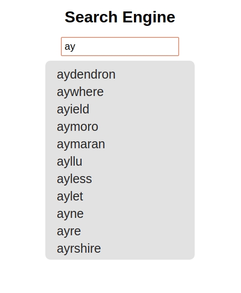

# TrieAutocomplete
Trie implementation for Autocomplete Search.
It uses words from english-words dataset taken from here: 
https://github.com/dwyl/english-words/

* generate.py takes words_alpha.txt and inserts only an amount of full dataset. 

* Trie.js and TrieNode.js are implementation of Trie based on this implementation 
https://gist.github.com/tpae/72e1c54471e88b689f85ad2b3940a8f0

* fillDatabase.js inserts corresponding data into the Trie. 

* index.html handles all frontend.

# Screenshots 

